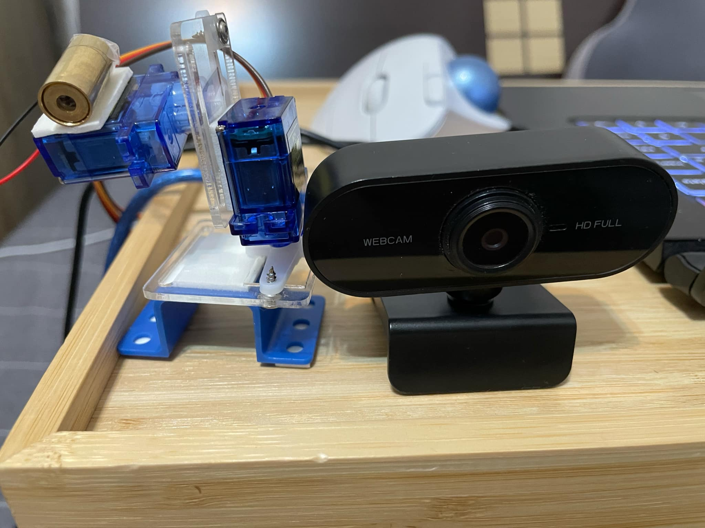
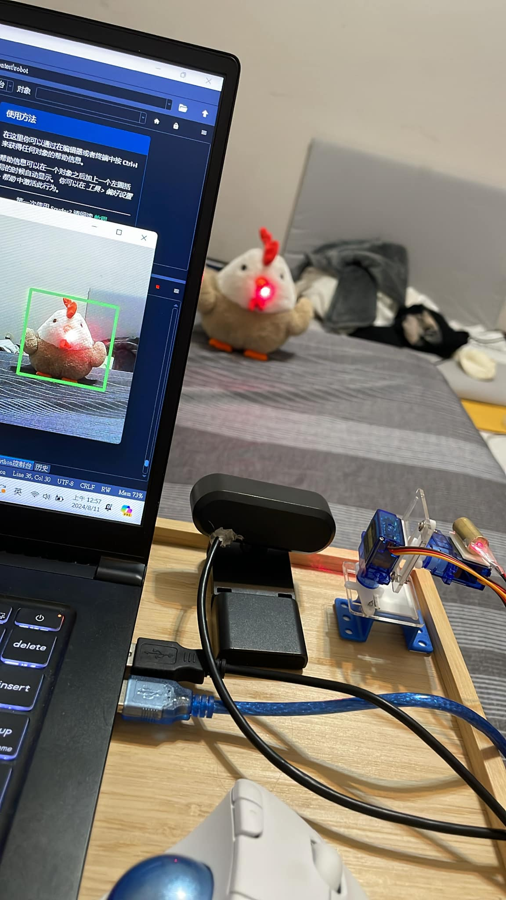
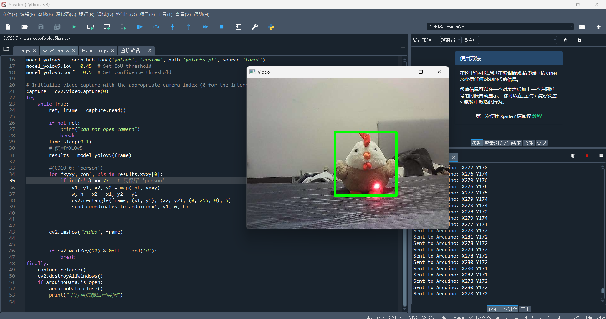

# Laser-Servo-Motor-YOLOv5

這個項目結合了雷射、伺服馬達與 YOLOv5，用來辨識物體並進行相應的動作。




## 步驟

1. **構建機械結構**：先完成硬體部分的搭建，包括雷射和伺服馬達的安裝。
2. **上傳程式碼到 Arduino**：將控制雷射和伺服馬達的程式碼上傳至 Arduino 控制板。
3. **下載 YOLOv5**：去下載 YOLOv5 資料夾，並設置好環境以進行物體辨識。


-----------------------------------------------------------------


### 程式碼示例

以下是用於辨識並保留 `person` 類別的程式碼片段：

```python
# (COCO 0: 'person')
for *xyxy, conf, cls in results.xyxy[0]:
    if int(cls) == 0:  # 只保留 'person'
        # 這裡是處理 'person' 的邏輯

## YOLOv5 辨識物體類別

本項目使用 COCO 資料集中的物體類別進行辨識。以下是部分類別列表及其對應的數字編號：


0 - Person
1 - Bicycle
2 - Car
3 - Motorcycle
4 - Airplane
5 - Bus
6 - Train
7 - Truck
8 - Boat
9 - Traffic Light
10 - Fire Hydrant
11 - Stop Sign
12 - Parking Meter
13 - Bench
14 - Bird
15 - Cat
16 - Dog
17 - Horse
18 - Sheep
19 - Cow
20 - Elephant
21 - Bear
22 - Zebra
23 - Giraffe
24 - Backpack
25 - Umbrella
26 - Handbag
27 - Tie
28 - Suitcase
29 - Frisbee
30 - Skis
31 - Snowboard
32 - Sports Ball
33 - Kite
34 - Baseball Bat
35 - Baseball Glove
36 - Skateboard
37 - Surfboard
38 - Tennis Racket
39 - Bottle
40 - Wine Glass
41 - Cup
42 - Fork
43 - Knife
44 - Spoon
45 - Bowl
46 - Banana
47 - Apple
48 - Sandwich
49 - Orange
50 - Broccoli
51 - Carrot
52 - Hot Dog
53 - Pizza
54 - Donut
55 - Cake
56 - Chair
57 - Couch
58 - Potted Plant
59 - Bed
60 - Dining Table
61 - Toilet
62 - TV
63 - Laptop
64 - Mouse
65 - Remote
66 - Keyboard
67 - Cell Phone
68 - Microwave
69 - Oven
70 - Toaster
71 - Sink
72 - Refrigerator
73 - Book
74 - Clock
75 - Vase
76 - Scissors
77 - Teddy Bear
78 - Hair Drier
79 - Toothbrush
```

